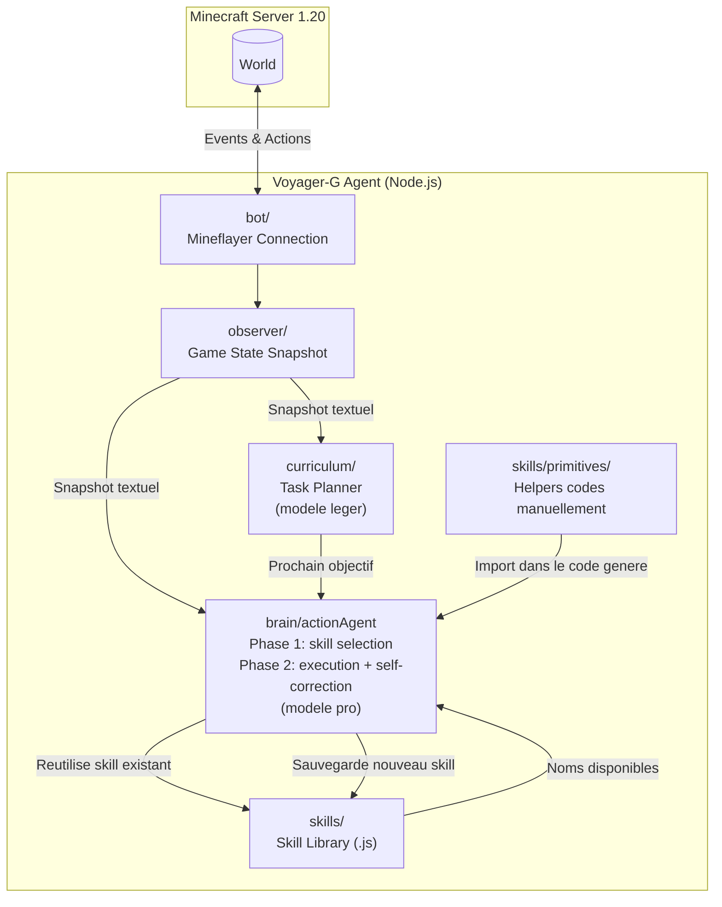
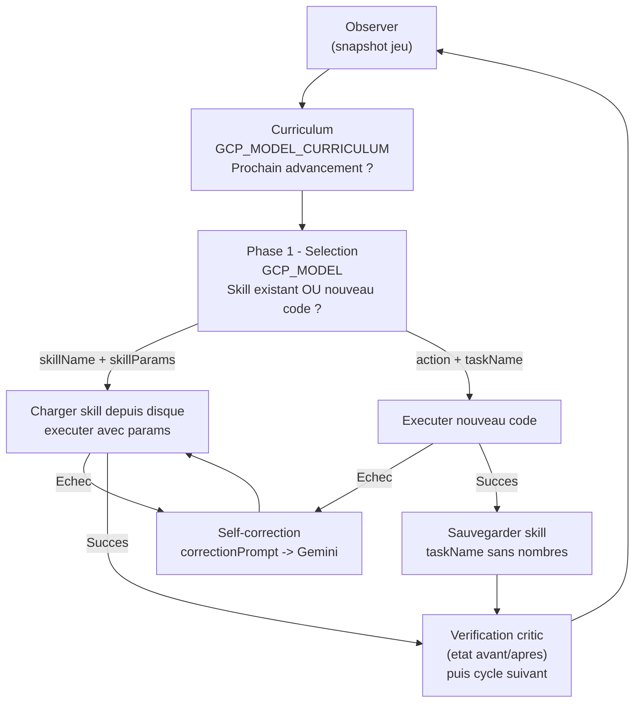
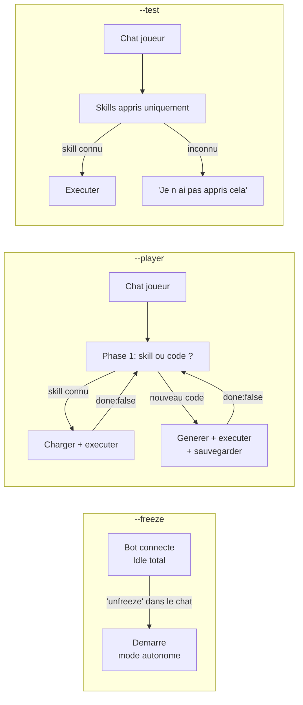

# Voyager-G

Agent Minecraft autonome inspire du papier **Voyager** (Wang et al., 2023), construit avec **Node.js**, **Mineflayer** et **Google Gemini** (Vertex AI).

Projet realise dans le cadre d'un memoire de Master sur l'evolution de l'IA dans les jeux video (des machines a etats finis vers les agents LLM autonomes).

---

## Lancement (commandes npm)

Toutes les commandes ont un raccourci `npm run ...` (pas besoin de retenir les options) :

| Commande              | Equivalent                  | Description                                                              |
| --------------------- | --------------------------- | ----------------------------------------------------------------------- |
| `npm start`           | `node src/index.js`         | Mode autonome (boucle Voyager : observe -> planifie -> agit -> apprend). |
| `npm run freeze`      | `... --freeze`              | Bot connecte mais idle ; demarre quand un joueur dit "unfreeze".        |
| `npm run player`      | `... --player`              | Le bot ecoute le chat et repond / agit.                                 |
| `npm run test`        | `... --test`                | Le bot utilise UNIQUEMENT les skills appris (pas d'improvisation).       |
| `npm run clear`       | `... --clear`               | Nouvelle iteration : efface les skills, teleporte, repart de zero.       |
| `npm run clear:player`| `... --clear --player`      | Nouvelle iteration + mode player (reset et interaction manuelle).        |
| `npm run dev`         | `node --watch ...`          | Mode autonome avec redemarrage auto a chaque modif de code.             |
| `npm run dashboard`   | `node tools/web.js`         | Lance le dashboard web SEUL (sans bot) pour consulter les sessions.      |
| `npm run sessions`    | `node tools/clean-sessions` | Liste les sessions et celles qui seraient supprimees (aucune suppression).|
| `npm run sessions:clean` | `... --delete`           | Supprime les sessions avec moins de 5 items distincts.                   |

### Parametre `--stop-at N` (budget de generation de code)

Arrete le bot proprement apres **N generations de code** (appels Gemini avec `role: "codegen"`).
Utile pour laisser le bot tourner en arriere-plan sans exploser l'API.

```bash
npm run stop-at -- 100
# ou directement : node src/index.js --stop-at 100
```

Quand la limite est atteinte, le bot :
1. Envoie dans le chat Minecraft : `[VoyagerG] Limite de 100 gen. de code atteinte (run: Voyager-G.iteration.json) | <inventaire>`
2. Se deconnecte du serveur.
3. Coupe le processus Node (`process.exit`), sans reconnexion automatique.

> [!NOTE]
> `--stop-at` ne reinitialise **pas** la session. La prochaine fois que le bot demarre
> (sans `--clear`), il reprend la meme iteration avec le meme username.

**Combinaisons possibles :** tous les flags sont independants et cumulables.

| Commande                                    | Comportement                                              |
| ------------------------------------------- | --------------------------------------------------------- |
| `npm run stop-at -- 100`                    | Mode autonome, arret apres 100 gen. (meme session)        |
| `npm run stop-at -- 50 --clear`             | Nouvelle session, arret apres 50 gen.                     |
| `npm run stop-at -- 50 --freeze`            | Demarre en freeze, arret apres 50 gen. quand unfreeze     |
| `npm run stop-at -- 50 --player`            | Mode player, arret apres 50 gen.                          |

---

## Configuration recommandee du serveur

> [!IMPORTANT]
> Le bot rejoint sous un nom **par itération** : `<MC_USERNAME>_<n>` (ex. `Voyager-G_3`).
> Chaque run est donc un joueur Minecraft neuf. Le nom exact est affiche dans les logs au demarrage.
> Un nouveau run (`--clear`) incremente l'iteration et change le nom.

### Auto-OP via RCON (recommande)

Comme le nom change a chaque itération, le bot est **op automatiquement au spawn via RCON**
(un datapack ne peut pas appeler `/op`, mais la console RCON le peut). Cela couvre n'importe quel
nom dynamique, sans aucune action manuelle. **Tout le setup serveur passe par RCON** (pas par le
bot lui-meme) :
- `difficulty` = `MC_DIFFICULTY` (defaut **peaceful** : pas de mobs hostiles -> evite les kicks de knockback) ;
- `gamerule keepInventory true`, `doDaylightCycle false`, **`fallDamage false`** ;
- **fire resistance + night vision infinies** a tout le monde (`@a`) ;
- **scoreboard sante/faim** mis a jour par le bot via `bot.chat` sur chaque evenement `health` (temps reel, sans flood) — fonctionne car le bot est auto-ope au spawn.

Pre-requis **une seule fois** dans `game/server.properties` (puis redemarrer le serveur) :

```
enable-rcon=true
rcon.password=voyager-rcon      # doit correspondre a RCON_PASSWORD dans .env
rcon.port=25575                 # doit correspondre a RCON_PORT dans .env
```

Pour desactiver l'auto-op : `RCON_ENABLED=false` dans `.env`.

### Fallback : commandes manuelles

Si RCON est desactive (`RCON_ENABLED=false`), opez le bot manuellement (nom visible dans les logs)
et appliquez la config a la main :

```
/op Voyager-G_<n>
/difficulty peaceful
/gamerule keepInventory true
/gamerule doDaylightCycle false
/gamerule fallDamage false
/effect give @a minecraft:fire_resistance infinite 0 true
/effect give @a minecraft:night_vision infinite 0 true
/scoreboard objectives add Stats dummy "Bot Stats"
/scoreboard objectives setdisplay sidebar Stats
```

> [!NOTE]
> Sans RCON le bot ne sera pas OP et ses commandes `/scoreboard` seront ignorees par le serveur :
> la barre laterale Health/Food n'apparaitra pas.

---

## Observer le bot en action

### Mode spectateur

La meilleure facon de suivre le bot sans le deranger est le mode spectateur :

```
/gamemode spectator
```

Ensuite, **cliquez sur le bot** dans la liste des entites ou directement en jeu pour vous "attacher"
a sa camera. Vous verrez exactement ce que le bot voit et pourrez suivre ses deplacements en temps reel.

### Inventaire en temps reel (navigateur)

Le bot expose son inventaire via une interface web. Ouvrez votre navigateur a l'adresse :

```
http://localhost:3000
```

Le port est configurable dans le `.env` via la variable `INVENTORY_VIEWER_PORT`.

---

## Ce que le LLM "voit" a chaque cycle

A chaque appel au LLM, le module **Observer** construit un snapshot textuel complet de l'etat du jeu. Voici exactement ce qui est transmis :

```
=== AGENT STATE ===
Health: 20/20 | Food: 20/20 | Experience: level 0
Position: x=12, y=64, z=-34
Time of day: 4200 ticks (morning)
Biome: minecraft:forest
Held item: wooden_pickaxe

Inventory (3 slot(s) used):
  - oak_log x4
  - stick x8
  - wooden_pickaxe x1

Nearby blocks (radius 16):
  - grass_block: 412
  - dirt: 198
  - oak_log: 47
  - stone: 203
  - iron_ore: 12
  ...

Nearby entities (radius 32):
  - cow (mob): 3 (closest 8m)
  - zombie (mob): 1 (closest 22m)
```

**Ce que le LLM connait :**

| Donnee                                | Source                    | Transmis                                                  |
| ------------------------------------- | ------------------------- | --------------------------------------------------------- |
| Inventaire complet (nom x quantite)   | `observer/inventory.js`   | Oui                                                       |
| Item tenu en main                     | `observer/inventory.js`   | Oui                                                       |
| Position XYZ                          | `observer/environment.js` | Oui                                                       |
| Top 20 blocs proches (rayon 16 blocs) | `observer/environment.js` | Oui                                                       |
| Biome et heure du jour                | `observer/environment.js` | Oui                                                       |
| Entites visibles (rayon 64 blocs)     | `observer/entities.js`    | Oui (configurable via `ENTITY_SCAN_RADIUS`)               |
| Sante / faim / niveau XP              | `observer/index.js`       | Oui                                                       |
| Noms des skills deja appris           | `listSkills()`            | Oui                                                       |
| Advancements Minecraft natifs         | aucune source             | **Non** (la progression est portee par l'etat du serveur : un nom de joueur neuf par run) |

---

## Architecture Generale



---

## Boucle Autonome (deux phases)



**Principe cle :** Gemini ne reecrit jamais un skill connu. En phase 1, il choisit soit un nom de skill existant (zero token de generation de code), soit ecrit du code nouveau. Les skills sont toujours parametres (`params.count`, `params.blockName`) pour etre generiques et reusables.

---

## Modes disponibles



---

## Arborescence du Projet

```
Voyager-G/
├── .env                          # Variables d'environnement (GCP, Minecraft)
├── package.json
│
├── game/                         # Serveur Minecraft 1.20 vanilla
│   └── ...
│
├── tools/
│   ├── web.js                    # Lance le dashboard seul (sans bot) : npm run dashboard
│   └── clean-sessions.js         # Supprime les sessions ininteressantes : npm run sessions
│
└── src/
    ├── index.js                  # Point d'entree, branchement des 4 modes (config via .env)
    │
    ├── state/
    │   └── run.js                # Identite du run: username "<base>_<iteration>" + compteur d'iteration
    │
    ├── bot/
    │   ├── createBot.js          # Factory Mineflayer (username par iteration) + pathfinder
    │   ├── rcon.js               # Client RCON minimal: auto-OP du bot au spawn (nom dynamique)
    │   └── events.js             # Handlers evenements (spawn, kick, death, chat)
    │
    ├── observer/
    │   ├── index.js              # Agregateur: produit le snapshot textuel complet
    │   ├── inventory.js          # Inventaire + item en main
    │   ├── environment.js        # Blocs proches, position, biome, heure
    │   └── entities.js           # Entites a portee (mobs, joueurs)
    │
    ├── brain/
    │   ├── gemini.js             # Client Vertex AI (singleton, ADC, support model override)
    │   ├── prompts.js            # Templates: systemPrompt, skillSelectPrompt, correctionPrompt,
    │   │                         #   curriculumPrompt, playerChatPrompt, testChatPrompt
    │   ├── actionAgent.js        # Phase 1 (selection) + Phase 2 (execution + self-correction)
    │   ├── criticAgent.js        # Self-verification: valide la reussite via l'etat avant/apres
    │   ├── playerMode.js         # Mode --player: chaining multi-etapes avec skill reuse
    │   ├── testMode.js           # Mode --test: skills appris uniquement
    │   └── freezeMode.js         # Mode --freeze: idle total, attend 'unfreeze' dans le chat
    │
    ├── curriculum/
    │   └── curriculum.js         # Propose le prochain advancement (modele leger separe)
    │
    ├── skills/
    │   ├── library.js            # CRUD fichier: saveSkill / loadSkill / listSkills
    │   ├── embeddings.js         # Cache vectoriel + retrieval semantique (state/skill-embeddings.json)
    │   ├── retrieval.js          # Selection top-K des skills par similarite cosinus (fallback: lexical)
    │   ├── primitives/           # Helpers codes manuellement, importables par le code LLM
    │   │   ├── mining.js         # mineBlock(bot, mcData, blockName)
    │   │   ├── crafting.js       # craftItem(bot, mcData, itemName, count)
    │   │   ├── navigation.js     # goTo / goToEntity
    │   │   ├── combat.js         # attackNearest / flee / waitForMobRemoved
    │   │   ├── inventory.js      # getInventorySummary / countItem / hasItem / equipItem
    │   │   │                     # equipBestPickaxe / equipBestSword
    │   │   ├── smeltItem.js      # smeltItem(bot, mcData, inputItem, count)
    │   │   │                     # Pose un four si necessaire, choisit le carburant auto
    │   │   ├── placeItem.js      # placeBlock / placeBlockAt (coordonnees exactes)
    │   │   │                     # buildBox (coque sol+murs+toit) / placeAndReclaim
    │   │   └── exploreUntil.js   # exploreUntilBlock / exploreUntilEntity
    │   │                         # Se deplace jusqu'a trouver la ressource
    │   └── learned/              # Skills generes par Gemini (parametres)
    │       └── ...
    │
    └── utils/
        ├── logger.js             # Logger niveaux debug/info/warn/error
        └── helpers.js            # sleep(), truncate(), safeStringify()
```

---

## Configuration des Modeles

Trois modeles configurables independamment dans `.env` :

| Variable               | Usage                                               | Recommandation          |
| ---------------------- | --------------------------------------------------- | ----------------------- |
| `GCP_MODEL`            | Generation de code (action agent, phase 1+2)        | `gemini-3.5-flash`      |
| `GCP_MODEL_CURRICULUM` | Choix du prochain objectif (texte simple)           | `gemini-3.1-flash-lite` |
| `GCP_EMBED_MODEL`      | Embeddings pour la recuperation semantique des skills | `gemini-embedding-001` |

Separer les modeles evite de consommer des tokens pro pour des taches qui n'en ont pas besoin.

> [!NOTE]
> `gemini-3.1-flash-lite` n'est disponible **qu'en region `global`**. Verifier la disponibilite
> des modeles selon la region GCP configuree (`GCP_LOCATION`) dans le `.env`.

---

## Detail des Fichiers Cles

| Fichier                        | Role                                                                                            |
| ------------------------------ | ----------------------------------------------------------------------------------------------- |
| `src/index.js`                 | Point d'entree. Connecte le bot, lance le mode selectionne (freeze / test / player / autonome). |
| `.env`                         | Toute la configuration (IP serveur, modeles Gemini, timeouts, mode CLI) via variables d'env.    |
| `src/state/run.js`             | Identite du run: calcule le username `<base>_<iteration>` et persiste le compteur d'iteration.  |
| `src/observer/index.js`        | Produit le snapshot textuel transmis au LLM a chaque cycle.                                     |
| `src/brain/gemini.js`          | Client Vertex AI avec ADC. `chat()` pour la generation, `embedQuery/embedDocument()` pour les embeddings. |
| `src/brain/prompts.js`         | Tous les templates de prompts. Inclut les exemples d'API primitives pour le LLM.                |
| `src/brain/actionAgent.js`     | Phase 1: selection skill/code (top-K). Phase 2: execution + self-correction (N retries).        |
| `src/brain/criticAgent.js`     | Self-verification: juge via delta d'inventaire calcule en code + delai settle (ne bloque pas la sauvegarde). |
| `src/brain/freezeMode.js`      | Bot idle. Ecoute "unfreeze" dans le chat pour demarrer l'entrainement.                          |
| `src/brain/playerMode.js`      | Mode interactif. Chaining multi-etapes avec reuse des skills appris.                            |
| `src/curriculum/curriculum.js` | Propose le prochain advancement a poursuivre (arbre complet Java 1.20).                         |
| `src/skills/library.js`        | CRUD fichier pour les skills appris (.js dans learned/).                                        |
| `src/skills/embeddings.js`     | Cache vectoriel des skills (`state/skill-embeddings.json`). Retrieval cosinus asymetrique.      |
| `src/skills/retrieval.js`      | Retourne les top-K skills par similarite cosinus (embedding) avec fallback lexical.             |
| `src/skills/primitives/`       | 8 helpers codes manuellement, exposes dans le system prompt pour le LLM.                        |
| `src/skills/learned/`          | Skills generes et sauvegardes. Toujours parametres.                                             |

---

## Stack Technique

- **Node.js** (JavaScript)
- **Mineflayer 4.x** + mineflayer-pathfinder
- **Google Gemini** via `@google/genai` (Vertex AI, ADC)
- **Minecraft 1.20** vanilla (Java 17)
