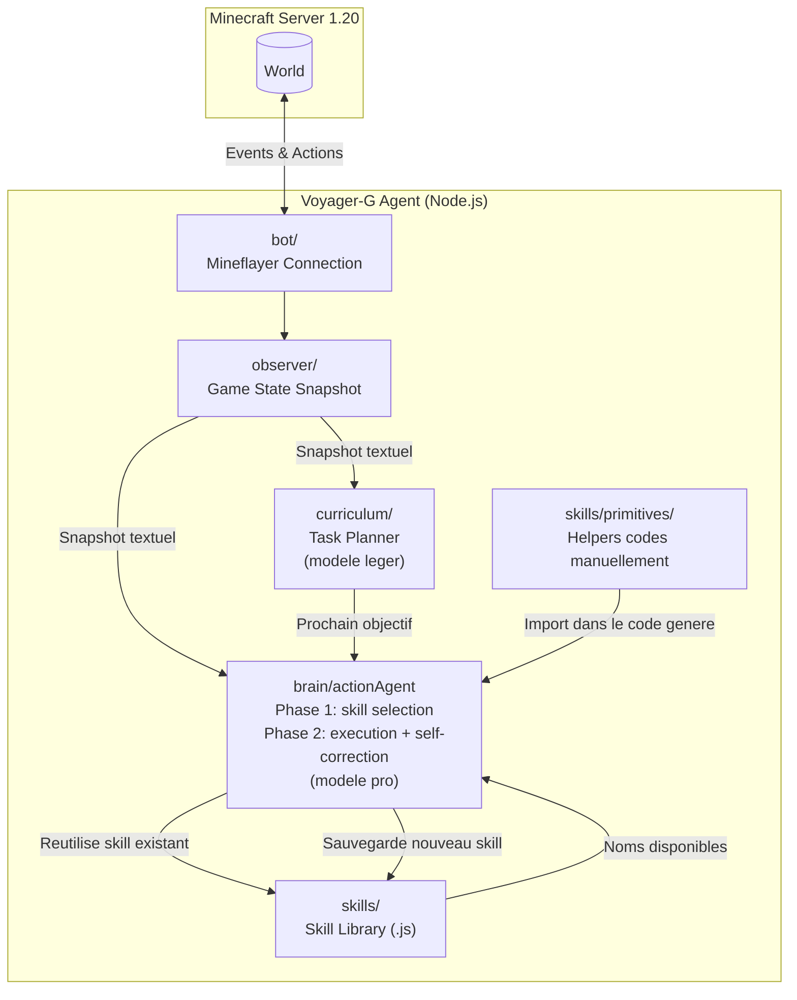
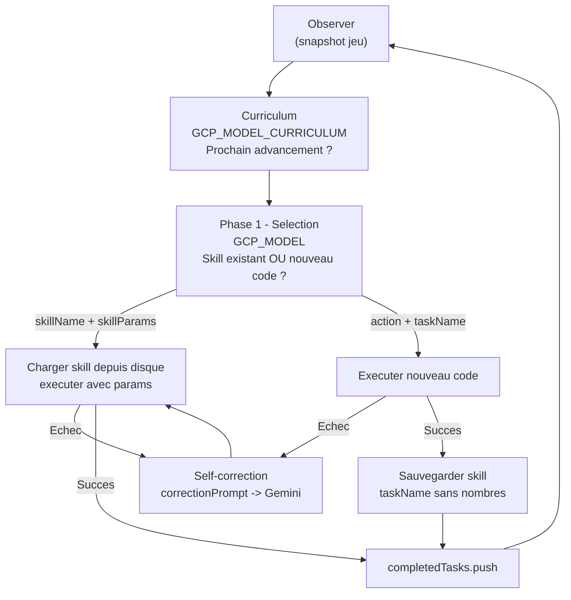
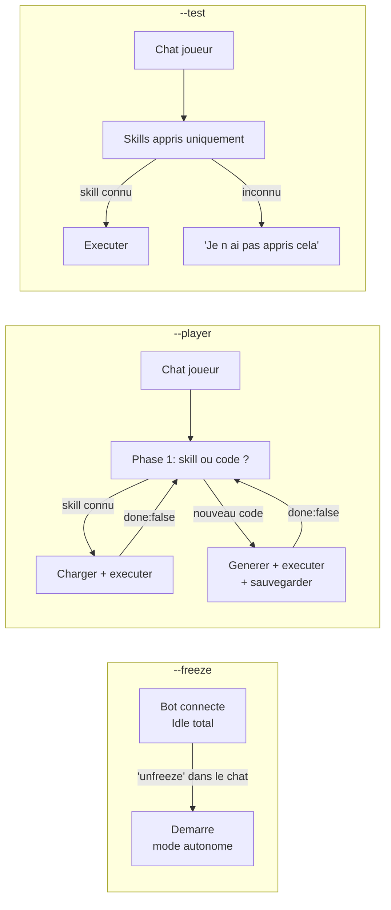

# Voyager-G

Agent Minecraft autonome inspire du papier **Voyager** (Wang et al., 2023), construit avec **Node.js**, **Mineflayer** et **Google Gemini** (Vertex AI).

Projet realise dans le cadre d'un memoire de Master sur l'evolution de l'IA dans les jeux video (des machines a etats finis vers les agents LLM autonomes).

---

## Lancement

```bash
# Mode autonome (boucle Voyager: observe -> planifie -> agit -> apprend)
node src/index.js

# Mode freeze (bot connecte mais idle - demarre l'entrainement quand un joueur dit "unfreeze" dans le chat)
node src/index.js --freeze

# Mode player (le bot ecoute le chat et repond / agit)
node src/index.js --player

# Mode test (le bot utilise UNIQUEMENT les skills appris, pas d'improvisation)
node src/index.js --test
```

---

## Configuration recommandee du serveur

Ces commandes Minecraft permettent de mieux observer et deboguer le bot sans perdre de temps.

**A effectuer une seule fois apres le demarrage du serveur :**

```
# Donner les droits OP au bot pour qu'il puisse envoyer ses commandes de scoreboard (sante, faim)
/op Voyager-G

# Activer la vision de nuit permanente pour mieux voir dans les mines et la nuit
/effect give @a night_vision 99999 1

# Conserver l'inventaire apres la mort pour ne pas perdre les outils acquis
/gamerule keepInventory true

# Desactiver le cycle jour/nuit pour gagner du temps de test
/gamerule doDaylightCycle false

# Garder la difficulte facile (les mobs causent moins de degats, le bot survit plus longtemps)
/difficulty easy
```

> **Note :** Sans `/op Voyager-G`, le bot ne peut pas executer ses commandes `/scoreboard` et la
> barre laterale Health/Food n'apparaitra pas.

---

## Observer le bot en action

### Mode spectateur

La meilleure facon de suivre le bot sans le deranger est le mode spectateur :

```
/gamemode spectator
```

Ensuite, **cliquez sur le bot** dans la liste des entites ou directement en jeu pour vous "attacher"
a sa camera. Vous verrez exactement ce que le bot voit et pourrez suivre ses deplacements en temps reel.

### Inventaire en temps reel (navigateur)

Le bot expose son inventaire via une interface web. Ouvrez votre navigateur a l'adresse :

```
http://localhost:3000
```

Le port est configurable dans le `.env` via la variable `INVENTORY_VIEWER_PORT`.

---

## Ce que le LLM "voit" a chaque cycle

A chaque appel au LLM, le module **Observer** construit un snapshot textuel complet de l'etat du jeu. Voici exactement ce qui est transmis :

```
=== AGENT STATE ===
Health: 20/20 | Food: 20/20 | Experience: level 0
Position: x=12, y=64, z=-34
Time of day: 4200 ticks (morning)
Biome: minecraft:forest
Held item: wooden_pickaxe

Inventory (3 slot(s) used):
  - oak_log x4
  - stick x8
  - wooden_pickaxe x1

Nearby blocks (radius 16):
  - grass_block: 412
  - dirt: 198
  - oak_log: 47
  - stone: 203
  - iron_ore: 12
  ...

Nearby entities (radius 32):
  - cow (mob): 3 (closest 8m)
  - zombie (mob): 1 (closest 22m)
```

**Ce que le LLM connait :**

| Donnee                                | Source                    | Transmis                                                  |
| ------------------------------------- | ------------------------- | --------------------------------------------------------- |
| Inventaire complet (nom x quantite)   | `observer/inventory.js`   | Oui                                                       |
| Item tenu en main                     | `observer/inventory.js`   | Oui                                                       |
| Position XYZ                          | `observer/environment.js` | Oui                                                       |
| Top 20 blocs proches (rayon 16 blocs) | `observer/environment.js` | Oui                                                       |
| Biome et heure du jour                | `observer/environment.js` | Oui                                                       |
| Entites visibles (rayon 32 blocs)     | `observer/entities.js`    | Oui                                                       |
| Sante / faim / niveau XP              | `observer/index.js`       | Oui                                                       |
| Noms des skills deja appris           | `listSkills()`            | Oui                                                       |
| Advancements Minecraft natifs         | aucune source             | **Non** (suivi via `completedTasks[]` en memoire session) |

---

## Architecture Generale



---

## Boucle Autonome (deux phases)



**Principe cle :** Gemini ne reecrit jamais un skill connu. En phase 1, il choisit soit un nom de skill existant (zero token de generation de code), soit ecrit du code nouveau. Les skills sont toujours parametres (`params.count`, `params.blockName`) pour etre generiques et reusables.

---

## Modes disponibles



---

## Arborescence du Projet

```
Voyager-G/
├── .env                          # Variables d'environnement (GCP, Minecraft)
├── package.json
│
├── game/                         # Serveur Minecraft 1.20 vanilla
│   └── ...
│
└── src/
    ├── index.js                  # Point d'entree, branchement des 4 modes
    │
    ├── config/
    │   └── settings.js           # Configuration centralisee (serveur, Gemini, observer, modes)
    │
    ├── bot/
    │   ├── createBot.js          # Factory Mineflayer + chargement pathfinder
    │   └── events.js             # Handlers evenements (spawn, kick, death, chat)
    │
    ├── observer/
    │   ├── index.js              # Agregateur: produit le snapshot textuel complet
    │   ├── inventory.js          # Inventaire + item en main
    │   ├── environment.js        # Blocs proches, position, biome, heure
    │   └── entities.js           # Entites a portee (mobs, joueurs)
    │
    ├── brain/
    │   ├── gemini.js             # Client Vertex AI (singleton, ADC, support model override)
    │   ├── prompts.js            # Templates: systemPrompt, skillSelectPrompt, correctionPrompt,
    │   │                         #   curriculumPrompt, playerChatPrompt, testChatPrompt
    │   ├── actionAgent.js        # Phase 1 (selection) + Phase 2 (execution + self-correction)
    │   ├── playerMode.js         # Mode --player: chaining multi-etapes avec skill reuse
    │   ├── testMode.js           # Mode --test: skills appris uniquement
    │   └── freezeMode.js         # Mode --freeze: idle total, attend 'unfreeze' dans le chat
    │
    ├── curriculum/
    │   └── curriculum.js         # Propose le prochain advancement (modele leger separe)
    │
    ├── skills/
    │   ├── library.js            # CRUD fichier: saveSkill / loadSkill / listSkills
    │   ├── primitives/           # Helpers codes manuellement, importables par le code LLM
    │   │   ├── mining.js         # mineBlock(bot, mcData, blockName)
    │   │   ├── crafting.js       # craftItem(bot, mcData, itemName, count)
    │   │   ├── navigation.js     # goTo / goToEntity
    │   │   ├── combat.js         # attackNearest / flee / waitForMobRemoved
    │   │   ├── inventory.js      # getInventorySummary / countItem / hasItem / equipItem
    │   │   │                     # equipBestPickaxe / equipBestSword
    │   │   ├── smeltItem.js      # smeltItem(bot, mcData, inputItem, count)
    │   │   │                     # Pose un four si necessaire, choisit le carburant auto
    │   │   ├── placeItem.js      # placeBlock / placeAndReclaim (pose + recupere)
    │   │   └── exploreUntil.js   # exploreUntilBlock / exploreUntilEntity
    │   │                         # Se deplace jusqu'a trouver la ressource
    │   └── learned/              # Skills generes par Gemini (parametres)
    │       └── ...
    │
    └── utils/
        ├── logger.js             # Logger niveaux debug/info/warn/error
        └── helpers.js            # sleep(), truncate(), safeStringify()
```

---

## Configuration des Modeles

Deux modeles LLM independants configurables dans `.env` :

| Variable               | Usage                                        | Recommandation           |
| ---------------------- | -------------------------------------------- | ------------------------ |
| `GCP_MODEL`            | Generation de code (action agent, phase 1+2) | `gemini-3.1-pro-preview` |
| `GCP_MODEL_CURRICULUM` | Choix du prochain objectif (texte simple)    | `gemini-2.0-flash-lite`  |

Separer les modeles evite de consommer des tokens pro pour une tache de planning qui ne necessite pas de generation de code.

---

## Detail des Fichiers Cles

| Fichier                        | Role                                                                                            |
| ------------------------------ | ----------------------------------------------------------------------------------------------- |
| `src/index.js`                 | Point d'entree. Connecte le bot, lance le mode selectionne (freeze / test / player / autonome). |
| `src/config/settings.js`       | Toute la configuration (IP serveur, modeles Gemini, timeouts, mode CLI).                        |
| `src/observer/index.js`        | Produit le snapshot textuel transmis au LLM a chaque cycle.                                     |
| `src/brain/gemini.js`          | Client Vertex AI avec ADC. Supporte l'override de modele par appel.                             |
| `src/brain/prompts.js`         | Tous les templates de prompts. Inclut les exemples d'API primitives pour le LLM.                |
| `src/brain/actionAgent.js`     | Phase 1: selection skill/code. Phase 2: execution + self-correction (N retries).                |
| `src/brain/freezeMode.js`      | Bot idle. Ecoute "unfreeze" dans le chat pour demarrer l'entrainement.                          |
| `src/brain/playerMode.js`      | Mode interactif. Chaining multi-etapes avec reuse des skills appris.                            |
| `src/curriculum/curriculum.js` | Propose le prochain advancement a poursuivre (arbre complet Java 1.20).                         |
| `src/skills/library.js`        | CRUD fichier pour les skills appris (.js dans learned/).                                        |
| `src/skills/primitives/`       | 8 helpers codes manuellement, exposes dans le system prompt pour le LLM.                        |
| `src/skills/learned/`          | Skills generes et sauvegardes. Toujours parametres.                                             |

---

## Stack Technique

- **Node.js** (JavaScript)
- **Mineflayer 4.x** + mineflayer-pathfinder
- **Google Gemini** via `@google/genai` (Vertex AI, ADC)
- **Minecraft 1.20** vanilla (Java 17)